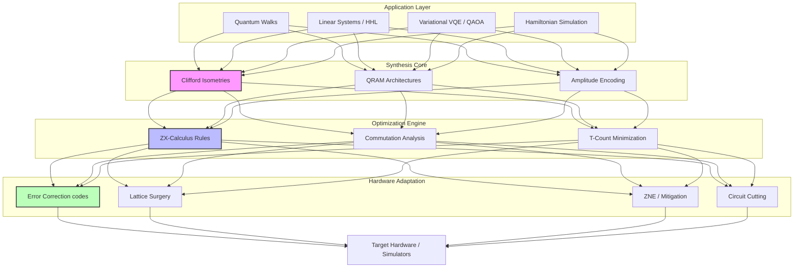

# Quantic-Rust: High-Performance Quantum Computing Library in Rust 🦀⚛️

<p align="center">
  
  
  
</p>

**Quantic-Rust** is an industry-grade Rust library with high-level Python bindings, engineered for advanced quantum circuit synthesis, deep optimization, and robust error analysis. It bridges the gap between theoretical algorithms and physical hardware, offering a comprehensive suite of tools for the NISQ and Fault-Tolerant eras.

---

## 🏗 Library Architecture



---

## 🚀 Key Capabilities at a Glance

| Module | Focus Area | Essential Features |
| :--- | :--- | :--- |
| **Algorithms** | High-level Logic | QFT, HHL, Quantum Walks, Trotter-Suzuki, QSVT |
| **Synthesis** | State Preparation | QRAM, Isometries, Dicke/W/GHZ, ESOP Synthesis |
| **Optimization** | Peak Performance | ZX-Calculus, T-count, CNOT minimization, Template Matching |
| **QEC** | Fault Tolerance | Surface codes, Lattice Surgery, QLDPC, MWPM/BP Decoders |
| **Variational** | Hybrid Computing | HEA, UCCSD, QAOA, Parameter-Shift Gradients |
| **Mitigation** | Noise Control | ZNE, PEC, CDR, Virtual Distillation, Circuit Cutting |

---

## 🛠 Installation

### 🐍 Python Interface (Recommended)
Quantic-Rust provides a seamless Python experience. Install it directly from the source:

```bash
pip install git+https://github.com/Mahir101/quantic-rust.git@main
```

*Prerequisite: Ensure the [Rust toolchain](https://rustup.rs/) is installed for compilation.*

### 🦀 Rust Crate
For low-level, high-performance integration, add Quantic-Rust to your `Cargo.toml`:

```toml
[dependencies]
quantic-rust = { git = "https://github.com/Mahir101/quantic-rust" }
```

---

## 📖 Module Deep-Dive

### 📡 Quantum Algorithms (`quantic-rust::algorithms`)
A robust register of foundational and advanced routines.
*   **Fourier Analysis**: Standard, Inverse, and depth-optimized Approximate QFT.
*   **Arithmetic Engine**: Draper/Ripple-carry adders, modular multipliers, and comparators.
*   **Dynamics**: Discrete (DTQW) and Continuous-time (CTQW) quantum walks.
*   **Linear Algebra**: Full HHL structure and Quantum Singular Value Transformation (QSVT) primitives.

### 🧩 Synthesis & State Prep (`quantic-rust::synthesis`)
Advanced methods for mapping operators to optimized gate sequences.
*   **Memory**: High-efficiency Bucket-Brigade and Fan-out **QRAM** constructions.
*   **Encoding**: Isometry-based preparation, Grover-Rudolph, and recursive Amplitude Encoding.
*   **Decompositions**: Full Quantum Shannon Decomposition (QSD) and two-level unitary mapping.

### ⚡ Circuit Optimization (`quantic-rust::optimization`)
Next-generation routines for minimizing resources on real hardware.
*   **ZX-Calculus**: Advanced spider fusion and pivot rules for topological optimization.
*   **Dynamic Pipeline**: Multi-pass cancellation, rotation merging, and commutator-aware reordering.
*   **Peephole Tuning**: Window-based optimization for local gate-set reduction.

### 🛡 Error Correction & Mitigation (`quantic-rust::error_correction`)
The toolkit for robust, reliable quantum computation.
*   **Topological Codes**: Surface code syndrome extraction and **Lattice Surgery** logic.
*   **NISQ Mitigation**: Zero Noise Extrapolation (ZNE), Probabilistic Error Cancellation (PEC), and CDR.
*   **Circuit Cutting**: Wire/Gate cutting to execute complex circuits on restricted QPU topologies.

---

## 💻 Python Quickstart

```python
import quantic_rust
from quantic_rust import Metric

# 1. Synthesize a Pauli Rotation Network
circuit = quantic_rust.pauli_network_synthesis(
    ["XYZI", "IZYX", "XIYI"], 
    metric=Metric.DEPTH
)

# 2. Apply Full Optimization Pipeline
optimized = quantic_rust.full_optimize(circuit)

# 3. Analyze Resource Consumption
stats = quantic_rust.analyze_circuit(optimized)
print(f"Total Gates: {stats['count']} | T-Depth: {stats['t_depth']}")
```

---

## 🛡 License
This project is licensed under the MIT License - see the [LICENSE.txt](LICENSE.txt) file for details.